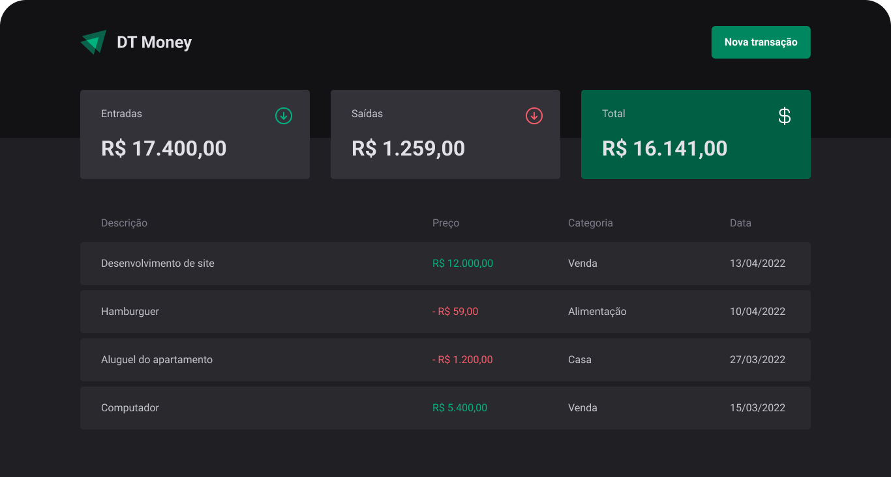

<h4 align="center">

</h4>

<h4 align="center">
    <p align="center">
      <a href="#-about">About</a>&nbsp;&nbsp;&nbsp;|&nbsp;&nbsp;&nbsp;
      <a href="#-technologies">Technologies</a>&nbsp;&nbsp;&nbsp;|&nbsp;&nbsp;&nbsp;
      <a href="#-how-to-run-the-project">Run</a>&nbsp;&nbsp;&nbsp;|&nbsp;&nbsp;&nbsp;
      <a href="#-info">Info</a>&nbsp;&nbsp;&nbsp;|&nbsp;&nbsp;&nbsp;
      <a href="#-license">License</a>
  </p>
</h4>

<h1 align="center">
  
</h1>

## 🔖 About

O **DT Money** é um projeto para controlar a vida financeira.

Com esse projeto é possível:

- Cadastrar com categoria entrada e saída de dinheiro;
- Calcular entradas, saídas e resumo geral;
- Listar todas as movimentações da recente a mais antiga;
- Pesquisar entre os dados cadastrados;

O layout está disponível no [Figma](https://www.figma.com/community/file/1138814493269096792)

## 🚀 Technologies

- [ReactJS](https://reactjs.org/)
- [TypeScript](https://www.typescriptlang.org/)
- [Vitejs](https://vitejs.dev/)
- [PhosphorIcons](https://phosphoricons.com/)
- [Styled Components](https://styled-components.com/)
- [Zod](https://zod.dev/)
- [React Hook Form](https://react-hook-form.com/)
- [Use Context Selector](https://github.com/dai-shi/use-context-selector)

## 🏁 How to run the project

```bash
# Clone the repository
git clone https://github.com/rafinhaa/dt-money.git
cd dt-money

# Install the dependencies
npm install

# Start fake api
npm run server

# Start the application
npm run dev
```

## ℹ️ Info

## 📝 License

[MIT](LICENSE)

**Free Software, Hell Yeah!**
